# AppForge

<p align="center">
  
</p>

<p align="center">
  
</p>

<p align="center">
  
</p>

<p align="center">
  
  <a href="https://github.com/MynameisDell/AppForge/stargazers">
    
  </a>
  
  
  
  
  
  
  
  
  
</p>

<p align="center">
  <strong><em>AppForge is a GUI-first App Store workflow suite for advanced iOS users.<br />
  It brings search, account sessions, license purchase, IPA download, version selection, direct install, local install, library management, and complete Mach-O decrypt workflows into one polished mobile interface.</em></strong>
</p>

<p align="center">
  Download current or older App Store versions, install packages that declare higher iOS requirements, then decrypt apps, frameworks, plug-ins, extensions, and watchOS payloads with a fast on-device workflow.
</p>

<p align="center">
  The main interface language is <b>English</b>. Users can switch to <b>Tiếng Việt</b> and other supported languages from Settings.
</p>

---

## Important IPA Installation Notice

<strong><em>AppForge's IPA installation workflow is different from the normal installation method used by TrollStore and sideload signing tools such as Esign, Feather, and similar signers.</em></strong>

<strong><em>At this stage, AppForge can use its installation workflow to place many IPA packages on device, including encrypted App Store IPA files. The main purpose of this path is to make the app bundle available for AppForge's decrypt workflow. It is not intended to make the installed app launch and run like a normally signed, TrollStore-installed, or sideload-signed application.</em></strong>

<strong><em>Because of that, an IPA installed through AppForge may crash when opened from the Home Screen, especially when the package is still encrypted or was installed only as a temporary decrypt target. This behavior does not mean the decrypt workflow has failed. It means the AppForge install path should be treated as a preparation step for decrypting the IPA, not as the final method for daily app use.</em></strong>

<strong><em>After AppForge finishes decrypting and exporting the decrypted IPA, install the exported IPA again through a normal method: sign and sideload it with a signing tool, or install it through TrollStore when the device and iOS version support TrollStore.</em></strong>

## 🎯 Product Focus

AppForge is designed as a GUI-first end-user application. The public release focuses on the English interface, polished preview experience, and installable `.tipa` package.

The app is built for users who want a complete App Store workflow directly on device: search apps, inspect metadata, choose storefront and platform, download IPA packages, select older or newer App Store versions, install local packages, direct-install with compatibility handling, decrypt installed apps, and manage exported IPA files.

The central promise is simple: find an app, choose the version you need, install it, and decrypt the complete payload with precision. AppForge is built to preserve the full application structure, including Mach-O binaries, frameworks, plugins, extensions, companion/watch payloads, and legacy slices when the device environment supports them.

The GUI is the primary experience. The `ipatool-ios` CLI capability set is documented because it powers the same advanced workflows for automation, SSH usage, debugging, and power-user operations.

## ✨ Highlights

- English main interface with selectable Tiếng Việt mode in Settings.
- Additional selectable languages for Korean, Simplified Chinese, Japanese, and French.
- App Store search by keyword, App Store URL, Bundle ID, or Track ID.
- Storefront selection with country search and persistent region settings.
- Platform browsing for iPhone, iPad, Mac, Watch, TV, and Vision categories.
- App detail page with metadata, screenshots, previews, ratings, version data, purchase, download, and direct install actions.
- Version browser with External Version ID search, copy action, latest badge, App Store date, and IPA date.
- GUI Downgrade from App Detail with a numbered version index, External Version ID search/copy, compact confirmation, and exact-version dispatch.
- Manual Direct Install from Library using either Bundle ID or Track ID, with lightweight Store target resolution and no unnecessary version-history scan.
- Manual Downgrade from Library using Bundle ID or Track ID, complete version intelligence, and an exact External Version ID lock.
- Automatic account-license preparation before Direct Install or Downgrade, including the existing purchase path for apps that are not yet owned.
- Owned-item fallback paths for previously purchased apps when public catalog metadata is unavailable, including delisted or storefront-restricted items when Apple still permits redownload.
- Download current or older app versions, then install and decrypt that exact package.
- Download and decrypt older versions for any available App Store app your account can access.
- Manual IPA download from Bundle ID, Track ID, External Version ID, or direct IPA URL.
- Package Library for downloaded IPA and PKG files.
- Local IPA install with compatibility patching and realtime install logs.
- CLI Direct Install `--buff` workflow with iOS 99.0.0 compatibility profile.
- Version bypass workflow for apps requiring a higher iOS version than the current device.
- Multi-platform recovery profiles for hard compatibility cases, including iPad, AppleTV, WatchOS, and legacy 32-bit paths where supported.
- Complete decrypt workflow for installed apps, including Mach-O executables, frameworks, plugins, extensions, FAT/universal binaries, 32-bit/64-bit slices, and watchOS-related payloads where supported.
- High-minimum-OS workflow for apps marked with iOS 26, iOS 27+, or newer App Store compatibility metadata.
- Decrypt output management with copy path, open folder, share, install, delete, and multi-select actions.
- Account tools for token refresh, account detail view, account switch/add, search limit, search region, and language selection.
- Personalization with interface themes, profile picture, and alternate AppForge icons.

## 🖼️ Preview

### Main GUI Flow

<table>
  <tr>
    <td width="33%" align="center">
      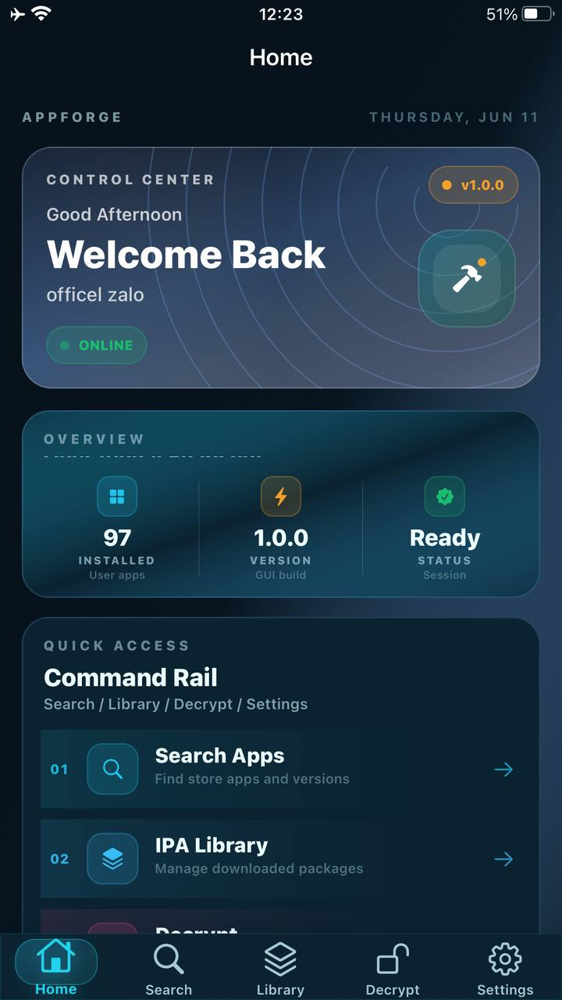
      <br />
      <b>Home</b>
      <br />
      Control Center, account state, installed app count, GUI version, quick access, and command rail.
    </td>
    <td width="33%" align="center">
      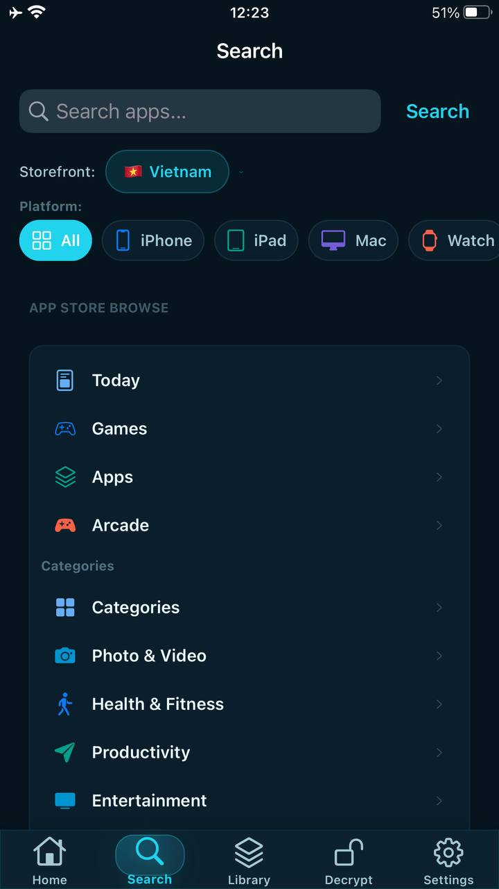
      <br />
      <b>Search</b>
      <br />
      App Store search with storefront selection, platform filters, categories, and fast discovery.
    </td>
    <td width="33%" align="center">
      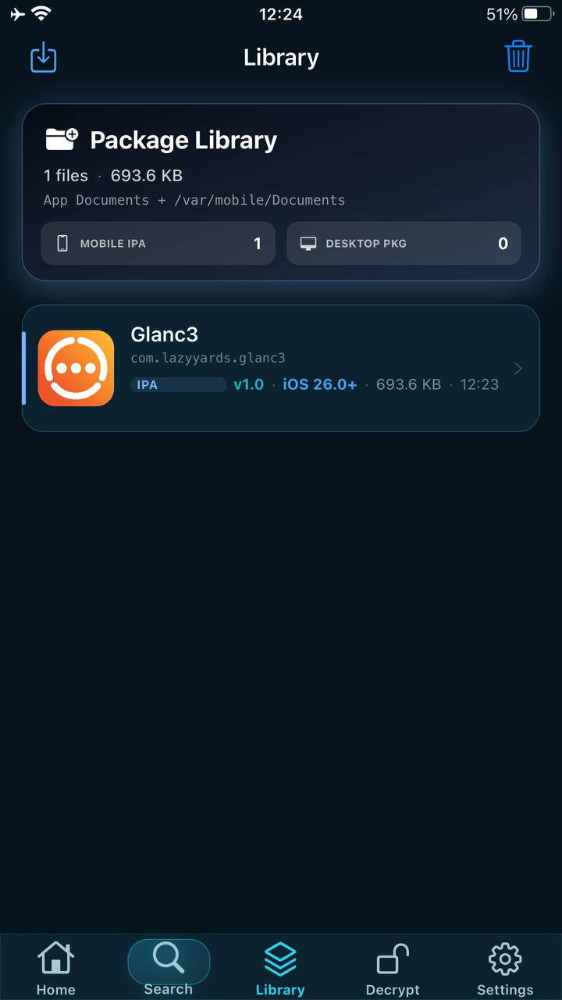
      <br />
      <b>Library</b>
      <br />
      Manage downloaded IPA/PKG packages, manual downloads, install actions, sharing, and cleanup.
    </td>
  </tr>
</table>

### Decrypt And Settings

<table>
  <tr>
    <td width="25%" align="center">
      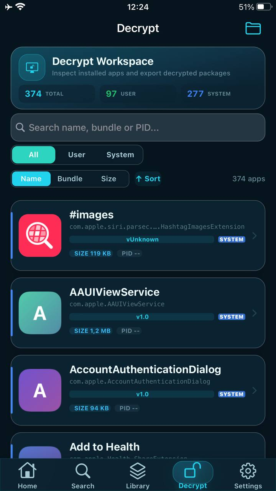
      <br />
      <b>Decrypt Workspace</b>
      <br />
      User/system app scanner with search, PID, bundle, version, size, filter, and sort controls.
    </td>
    <td width="25%" align="center">
      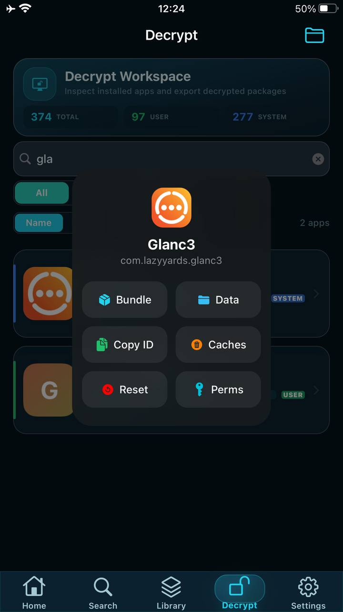
      <br />
      <b>Quick Actions</b>
      <br />
      Bundle, Data, Copy ID, Caches, Reset, and Permissions actions from a compact app sheet.
    </td>
    <td width="25%" align="center">
      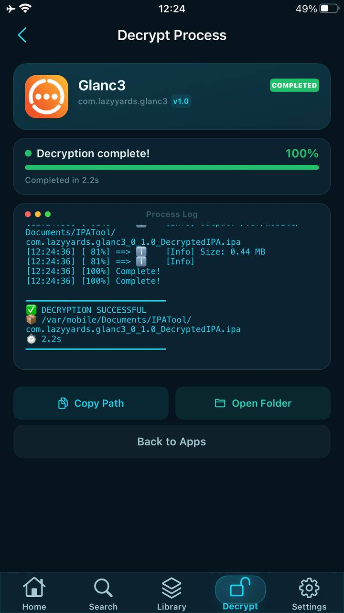
      <br />
      <b>Decrypt Process</b>
      <br />
      Realtime progress, process log, completion state, copy path, and open output folder.
    </td>
    <td width="25%" align="center">
      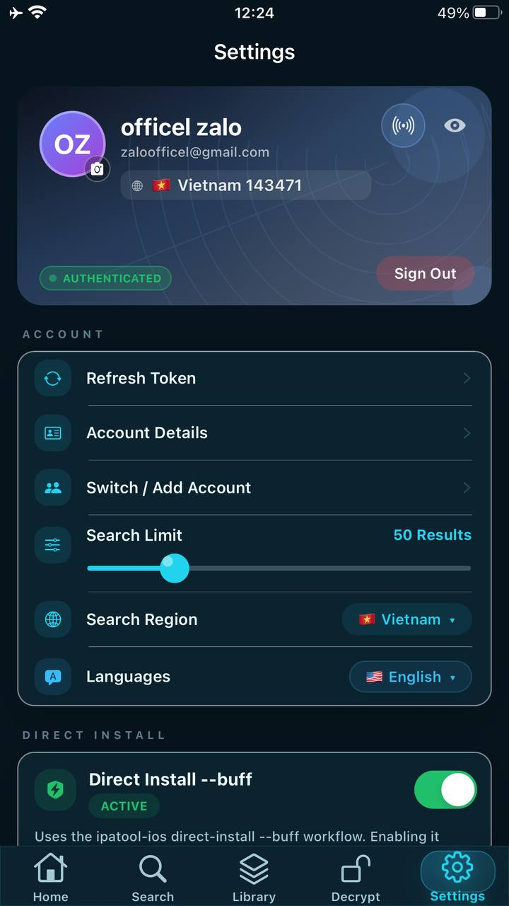
      <br />
      <b>Settings</b>
      <br />
      Account, token, search limit, region, language selector, root Direct Install compatibility controls, themes, icons, and UDID.
    </td>
  </tr>
</table>

### Search, Versions And Download

<table>
  <tr>
    <td width="33%" align="center">
      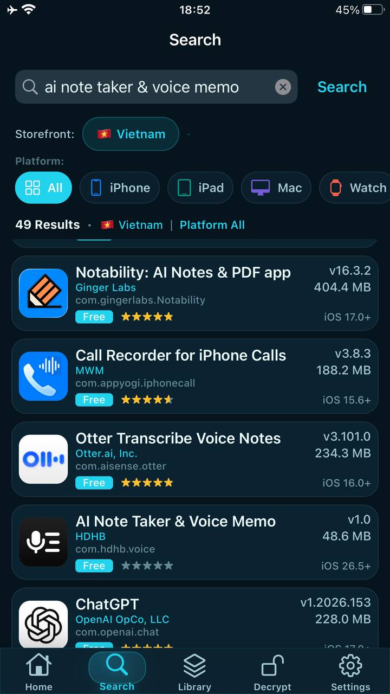
      <br />
      <b>High-iOS Search</b>
      <br />
      Search by keyword with Vietnam storefront, platform filters, ratings, size, version, and high minimum iOS metadata.
    </td>
    <td width="33%" align="center">
      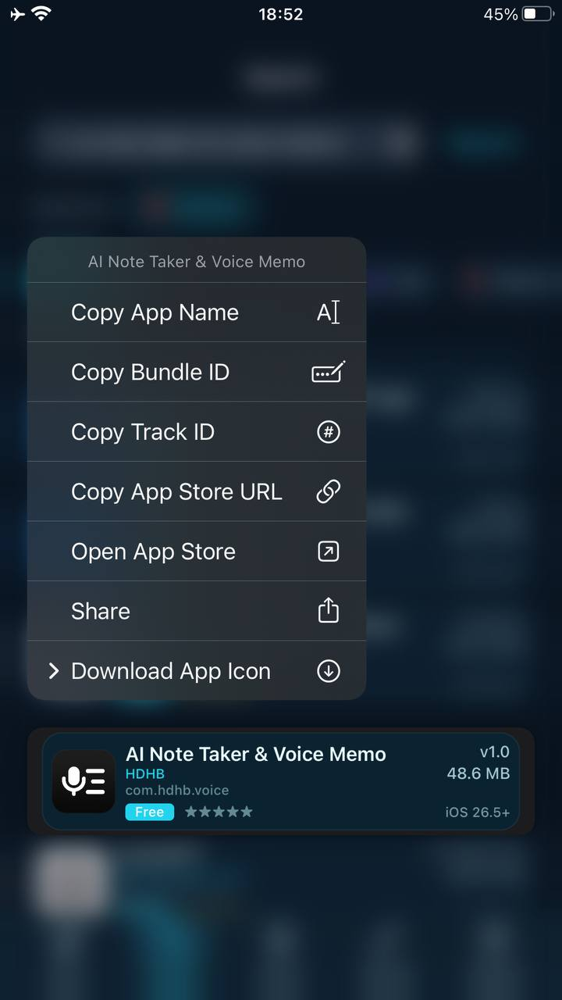
      <br />
      <b>Context Actions</b>
      <br />
      Copy app name, Bundle ID, Track ID, App Store URL, open App Store, share, and download app icons.
    </td>
    <td width="33%" align="center">
      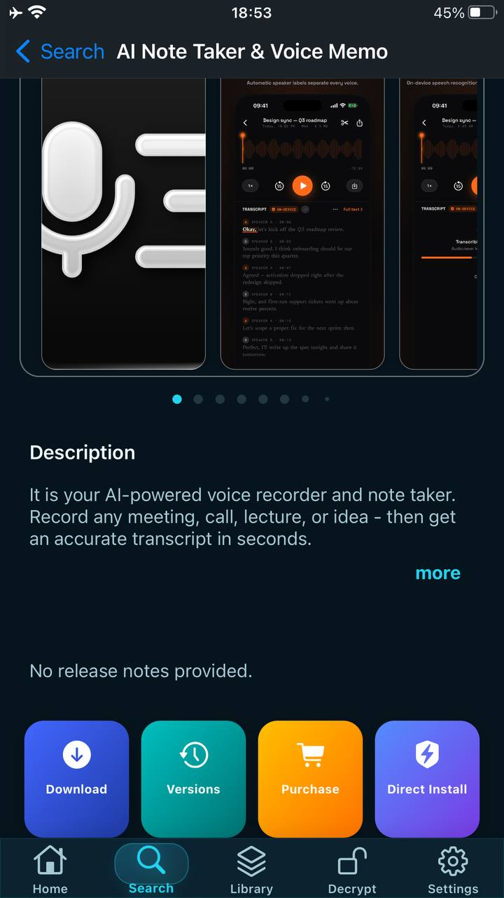
      <br />
      <b>App Detail</b>
      <br />
      Screenshots, description, release notes, Download, Versions, Downgrade, Purchase, and Direct Install actions in one page.
    </td>
  </tr>
  <tr>
    <td width="33%" align="center">
      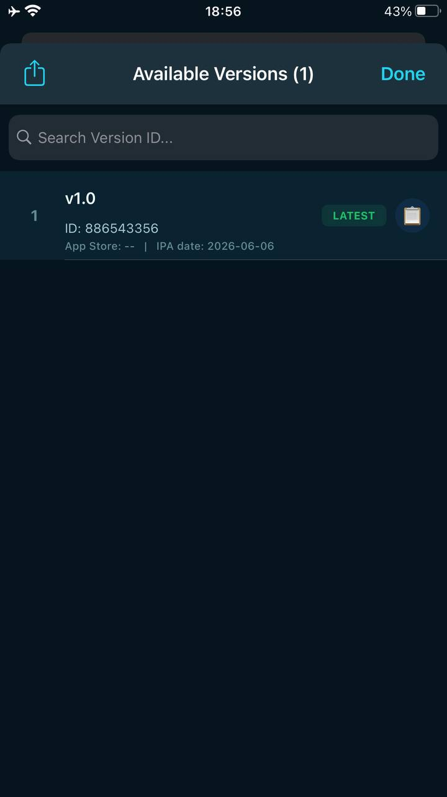
      <br />
      <b>Version Picker</b>
      <br />
      Search and copy External Version IDs with latest badge, App Store date, and IPA date for exact version targeting.
    </td>
    <td width="33%" align="center">
      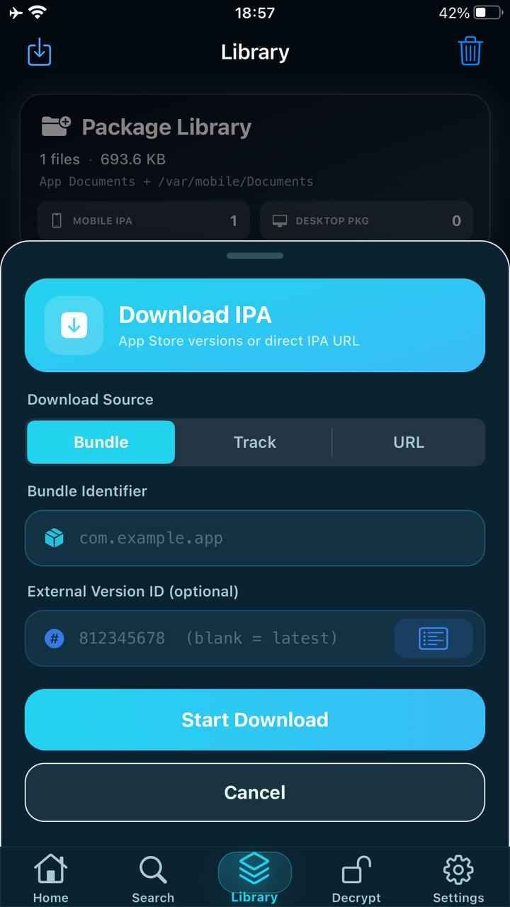
      <br />
      <b>Manual Download</b>
      <br />
      Download by Bundle ID, Track ID, or direct IPA URL, with optional External Version ID for older app versions.
    </td>
    <td width="33%" align="center">
      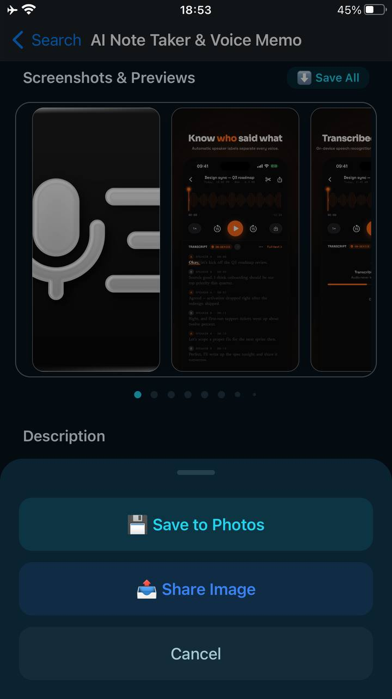
      <br />
      <b>Media Export</b>
      <br />
      Browse screenshots and previews, save all media, save to Photos, or share selected images.
    </td>
  </tr>
</table>

### Direct Install And Downgrade

<table>
  <tr>
    <td width="25%" align="center">
      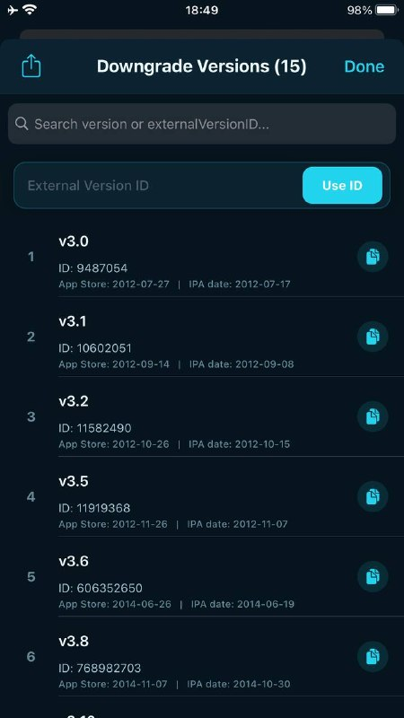
      <br />
      <b>Version Intelligence</b>
      <br />
      Browse a numbered version index, search by display version or External Version ID, inspect Store/IPA dates, and copy an ID directly.
    </td>
    <td width="25%" align="center">
      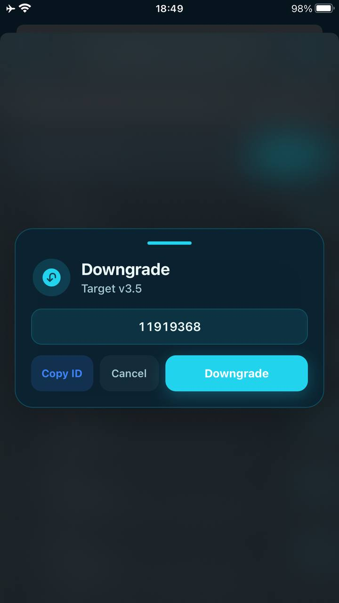
      <br />
      <b>Downgrade Confirmation</b>
      <br />
      Confirm the exact target version and External Version ID from a compact action sheet before dispatching the downgrade.
    </td>
    <td width="25%" align="center">
      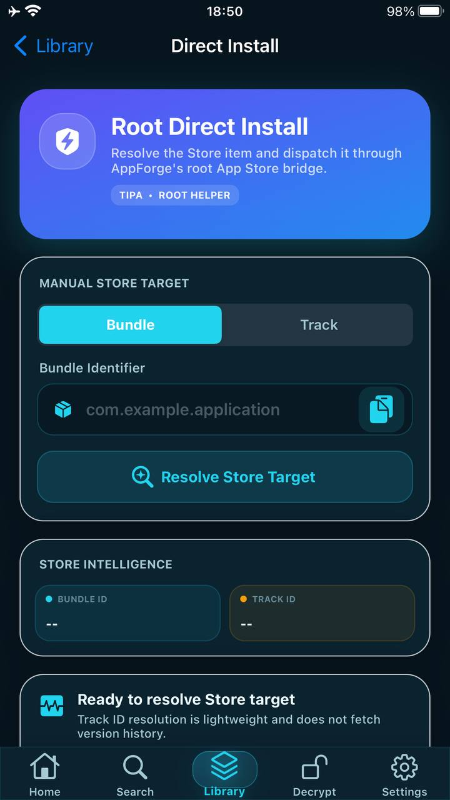
      <br />
      <b>Manual Direct Install</b>
      <br />
      Resolve a Bundle ID or Track ID and send the latest-version request through AppForge's bundled root App Store bridge.
    </td>
    <td width="25%" align="center">
      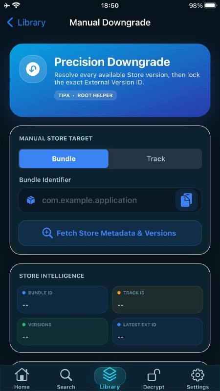
      <br />
      <b>Manual Downgrade</b>
      <br />
      Resolve Store metadata and historical versions, then select or enter the exact External Version ID to install.
    </td>
  </tr>
</table>

### Library, Account And Personalization

<table>
  <tr>
    <td width="25%" align="center">
      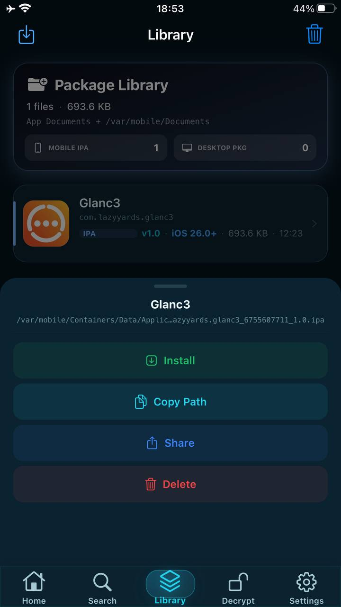
      <br />
      <b>Package Actions</b>
      <br />
      Install, copy path, share, or delete downloaded IPA/PKG packages from the Library sheet.
    </td>
    <td width="25%" align="center">
      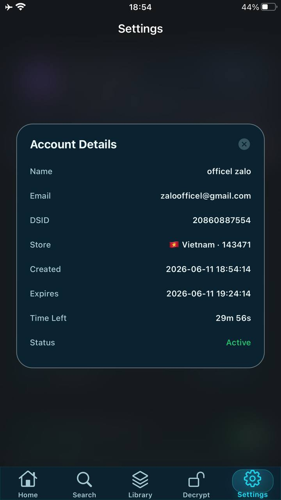
      <br />
      <b>Account Details</b>
      <br />
      View account name, email, DSID, storefront, creation time, expiration, time left, and active status.
    </td>
    <td width="25%" align="center">
      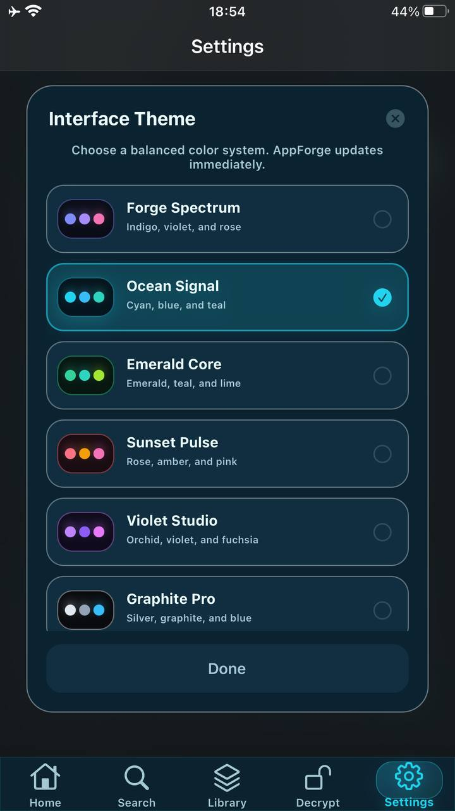
      <br />
      <b>Theme Picker</b>
      <br />
      Switch between polished visual themes such as Forge Spectrum, Ocean Signal, Emerald Core, and Graphite Pro.
    </td>
    <td width="25%" align="center">
      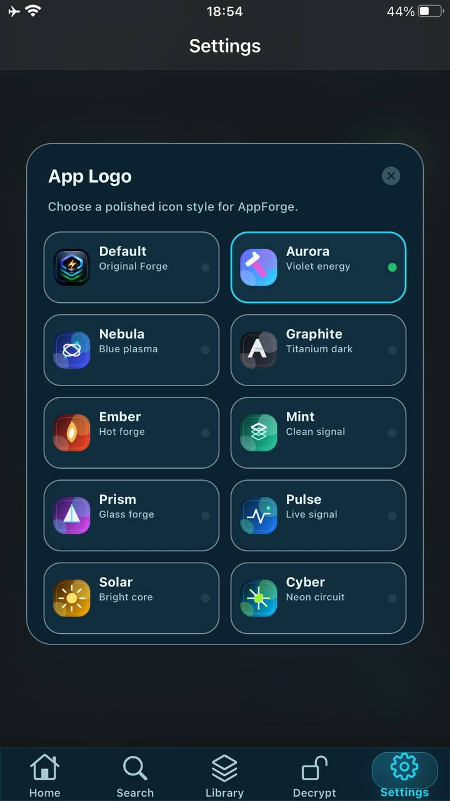
      <br />
      <b>App Logo</b>
      <br />
      Personalize AppForge with alternate icon styles including Aurora, Nebula, Graphite, Ember, Mint, Prism, Solar, and Cyber.
    </td>
  </tr>
</table>

### CLI Capability

<p align="center">
  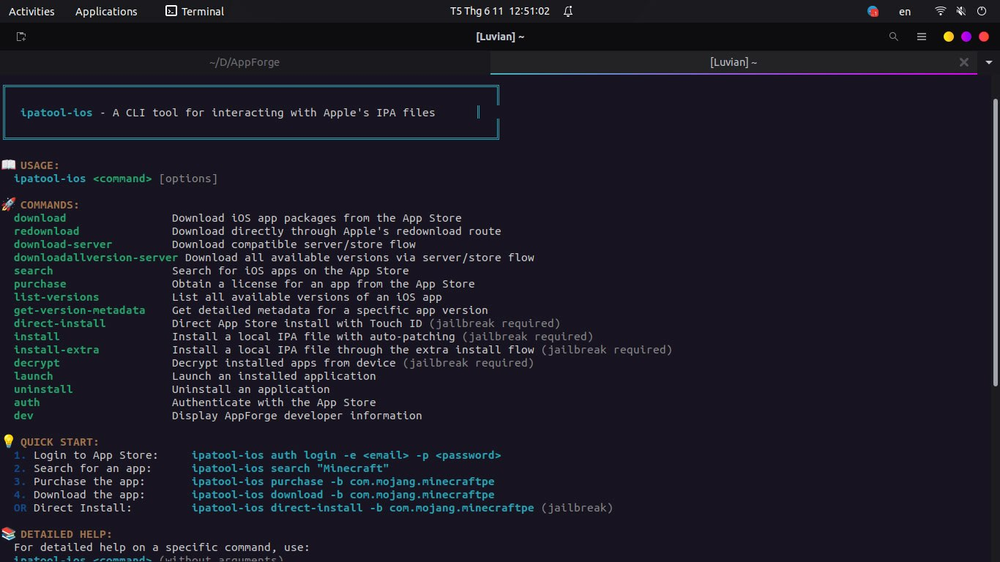
</p>

`ipatool-ios` is the power-user command layer behind AppForge workflows. It is useful for automation, SSH sessions, scripted downloads, direct install, local install, decrypt, launch, uninstall, and account handling.

## 🧩 GUI Features

### Home

- Displays the current AppForge session at a glance.
- Shows account identity, online/local status, installed user app count, GUI version, and readiness state.
- Provides quick access to Search, Library, Decrypt, and Settings.
- Uses animated cards, subtle gradients, tab spotlight motion, and haptic feedback.
- Keeps the first screen practical: no landing page, no marketing detour, only the dashboard and main workflows.

### Search

- Search by normal keyword.
- Paste an App Store URL and jump to the app detail page.
- Search with Bundle ID, such as `com.company.app`.
- Search with numeric Track ID.
- Choose Storefront by country, with searchable region picker.
- Filter by platform:
  - All
  - iPhone
  - iPad
  - Mac
  - Watch
  - TV
  - Vision
- Browse App Store-style sections such as Today, Games, Apps, Arcade, Categories, Photo & Video, Health & Fitness, Productivity, and Entertainment.
- Uses autocomplete-style suggestions while typing.
- Shows app icon, app name, bundle ID, version, minimum OS, platform signal, and store metadata.
- Displays result count, storefront, platform state, app size, rating, current version, and minimum iOS requirement directly in the result list.
- Makes high-minimum-OS apps visible in search results, including apps marked with iOS 26, iOS 27+, or newer App Store metadata.
- Long-press/context actions:
  - Copy App Name.
  - Copy Bundle ID.
  - Copy Track ID.
  - Copy App Store URL.
  - Open in App Store.
  - Share app.
  - Download app icon in 100x100, 512x512, or 1024x1024.

### App Detail

- Full app header with icon, app name, bundle tag, price, rating, category, version, size, compatibility, languages, age rating, copyright, and release date.
- Screenshot and preview gallery with horizontal browsing.
- Save all screenshots/previews.
- Save selected screenshots to Photos or share them directly from the media sheet.
- Displays app description and What's New text.
- Shows in-app purchase information when available.
- Action Center includes:
  - Download.
  - Versions.
  - Downgrade.
  - Purchase.
  - Direct Install.
- Download action includes realtime progress, percentage, size labels, progress bar, pause/resume, and cancel controls.
- Purchase action obtains an App Store license when the account session is valid.
- Versions action scans External Version IDs, release dates, IPA dates, latest badge, copy action, and version-specific download action.
- Older versions can be selected by External Version ID, downloaded as IPA, installed locally, and decrypted after install.
- Downgrade opens the complete historical version index, supports search/copy for External Version IDs, and dispatches the selected version through the root App Store bridge.
- Direct Install prepares the account license when required, then uses the AppForge compatibility bridge for an on-device App Store daemon handoff.
- GUI Direct Install `--buff` is integrated and uses the bundled AppForgeRootHelper carrier when enabled in Settings.

### Library

- Scans package locations such as app documents and `/var/mobile/Documents`.
- Detects Mobile IPA and Desktop PKG/MPKG packages.
- Reads package metadata when possible:
  - Display name.
  - Bundle ID.
  - Version.
  - Minimum OS.
  - Package type.
  - File size.
  - Modified time.
- Fetches app icons from store metadata when a Track ID or Bundle ID can be resolved.
- Shows IPA and PKG counters in the library header.
- Pull to refresh.
- Swipe actions for install and delete.
- File action sheet:
  - Install IPA.
  - Copy path.
  - Share package.
  - Delete package.
- Clear all library packages.
- Manual Store Lab provides two dedicated root Store workflows:
  - Direct Install by Bundle ID or Track ID.
  - Downgrade by Bundle ID or Track ID.
  - Paste action for identifiers.
  - Store target intelligence for resolved Bundle ID and Track ID.
  - Lightweight Direct Install resolution without fetching historical versions.
  - Full Downgrade version discovery with display versions, External Version IDs, Store dates, and IPA dates.
  - Numbered version rows, version/ID search, one-tap External Version ID copy, latest marker, and manual exact-ID entry.
  - Account-license preparation before the Store daemon transaction.
  - Root-helper dispatch, LaunchServices monitoring, and owned-item IPA fallback when the Store request does not materialize.
- Manual Download Sheet supports:
  - Bundle Identifier.
  - Track ID.
  - Direct IPA URL.
  - Optional External Version ID.
  - Segmented source switching between Bundle, Track, and URL.
  - Version scan button.
  - Version picker with External Version IDs.
  - 2FA prompt and retry.
  - Realtime download speed, elapsed time, downloaded size, total size, progress bar, and cancel.

### Version-To-Decrypt Workflow

AppForge is designed around exact-version recovery. A user can locate an app, inspect its available App Store versions, copy or select an External Version ID, download that exact IPA, install it, then decrypt the installed payload.

This workflow is useful for:

- Downloading an older version of an app when the latest version is too new for the device.
- Decrypting a historical app build for compatibility testing, preservation, or analysis.
- Installing an app that declares a higher iOS requirement, then using the decrypt workflow after the app is available on device.
- Repeating the same flow from GUI or CLI with the same Bundle ID, Track ID, and External Version ID model.

### GUI Direct Install

Direct Install is available from both App Detail and Library. App Detail already contains the resolved Store item, while Library's Manual Direct Install accepts a Bundle ID or numeric Track ID.

The GUI workflow:

1. Resolves the Store target and validates the Bundle ID/Track ID pair.
2. Uses a lightweight lookup for Manual Direct Install instead of downloading the historical version index.
3. Prepares the current Apple account license when the item is not already owned and the Store permits acquisition.
4. Sends the request to AppForgeRootHelper, which dispatches the transaction through `appstored`/`itunesstored` with the active compatibility profile.
5. Watches LaunchServices for the placeholder and final installed application.
6. Uses the owned-item redownload/download fallback when the daemon accepts a request but does not materialize the installation.

For an app removed from public App Store search, enter its numeric Track ID. Previously purchased items can use the authenticated owned-item route when Apple still exposes a valid redownload asset for that account.

### GUI Downgrade

Downgrade is available from App Detail and as Manual Downgrade in Library. It uses the same root Store carrier as Direct Install but locks the request to one exact External Version ID.

The Downgrade workflow includes:

- Historical version discovery from authenticated Store metadata.
- A numbered, searchable list of display versions and External Version IDs.
- App Store release date and IPA date when available.
- One-tap External Version ID copy and manual numeric ID entry.
- Compact confirmation showing the selected target version and ID.
- License preparation before dispatch.
- Exact-version fields applied across Store metadata, offer data, buy parameters, and root-helper payloads.
- LaunchServices monitoring for the target installed version.
- Owned-item IPA fallback for delisted or storefront-restricted applications when Apple still authorizes the account's historical download.

Downgrade availability ultimately depends on the signed-in Apple account owning or being allowed to acquire the item and Apple continuing to serve the selected historical asset.

### Install Process

- Dedicated install progress page for local IPA files.
- Detects app metadata from filename and package contents when possible.
- Fetches app icon and app name from iTunes metadata while install runs.
- Displays install phases, progress, and sanitized realtime logs.
- Supports normal install and extra install workflow.
- Applies compatibility handling for local IPA packages.
- Handles Device Family compatibility and tvOS icon compatibility.
- Shows success/failure state with final action button.

### Decrypt Workspace

- Scans installed apps on device.
- Separates user apps and system apps.
- Search by app name, Bundle ID, or PID.
- Filter modes:
  - All.
  - User.
  - System.
- Sort modes:
  - Name.
  - Bundle.
  - Size.
- Toggle ascending/descending sort direction.
- Shows app icon, app name, bundle ID, version, user/system badge, bundle size, and PID.
- Calculates bundle size in the background.
- Opens a dedicated decrypt process screen for the selected app.
- Supports decrypt by Bundle ID, app name, or PID in the underlying workflow.
- Default output location: `/var/mobile/Documents/DecryptedIPA`.

### Complete Mach-O Decrypt Engine

The decrypt workflow is the core strength of AppForge. It is built for speed, precision, and full payload coverage: normal apps, difficult App Store packages, protected binaries, framework-heavy apps, plugin-based apps, extensions, and companion/watch payloads where the runtime environment supports them.

<strong><em>100% Static Decrypt Method:</em></strong> AppForge emphasizes a static, deterministic decrypt pipeline for supported payloads, focusing on precise Mach-O extraction, slice handling, embedded component recovery, and clean IPA reconstruction without slow manual dumping steps.

Key capabilities:

- Decrypts the main Mach-O executable.
- Decrypts embedded frameworks and dynamic libraries.
- Decrypts plugins and app plug-ins.
- Decrypts app extensions when supported by the environment.
- Handles watchOS companion payloads and related embedded components where available.
- Handles 32-bit and 64-bit Mach-O formats.
- Handles FAT/universal binaries and thin binaries.
- Uses slice selection and thinning for FAT binaries.
- Uses mmap/ftruncate/MAP_SHARED-based file handling to reduce unnecessary I/O.
- Uses memory decrypt paths with `mremap_encrypted`.
- Uses isolated child/grandchild process handling for frameworks that are hostile to normal loader-based probing.
- Uses fallback paths for legacy and hard compatibility cases.
- Supports decrypt flows after installing packages that use high-iOS metadata such as iOS 26, iOS 27+, or newer compatibility declarations.
- Preserves the application bundle structure so the decrypted output remains practical to inspect, share, reinstall, or archive.
- Packages the result back into a standard IPA.

### Decrypt Quick Actions

From the app action sheet:

- Bundle: open the app bundle path.
- Data: open the app data container.
- Copy ID: copy Bundle ID.
- Caches: clear cache directories.
- Reset: reset app data.
- Perms: reset permissions.

When Filza or its URL handler is unavailable, AppForge copies the path so the user can still access it manually.

### Decrypted Files

- Lists exported decrypted IPA files.
- Shows storage location and file count.
- Pull to refresh.
- Open file action sheet.
- Copy path.
- Open in Filza.
- Share IPA.
- Install IPA.
- Delete file.
- Select mode for multiple files.
- Share selected files.
- Delete selected files.
- Clear all decrypted files.

### Settings

- Account hero card with avatar, initials, email, storefront, authenticated state, and sign in/out action.
- Hide/show account identity.
- Refresh Token.
- Account Details.
  - Name.
  - Email.
  - DSID.
  - Storefront.
  - Created time.
  - Expiration time.
  - Time left.
  - Active status.
- Switch/Add Account.
- Search Limit slider.
- Search Region picker.
- Languages picker with English, Tiếng Việt, Korean, Simplified Chinese, Japanese, and French options.
- Direct Install `--buff` enable/disable control for GUI root Store actions.
- Live bridge profile status for Store, variant, update, and installd compatibility hooks.
- Profile picture from camera or photo library.
- Interface Theme picker with polished presets:
  - Forge Spectrum.
  - Ocean Signal.
  - Emerald Core.
  - Sunset Pulse.
  - Violet Studio.
  - Graphite Pro.
- Alternate App Logo picker with multiple styles:
  - Default.
  - Aurora.
  - Nebula.
  - Graphite.
  - Ember.
  - Mint.
  - Prism.
  - Pulse.
  - Solar.
  - Cyber.
- Device UDID panel:
  - Direct UDID read when permissions allow it.
  - Copy UDID.
  - Refresh UDID.
  - Local profile service for session-only UDID capture.
- Maintenance:
  - Clean Cache.
  - Generate New GUID.

## 🌐 Interface Languages

AppForge includes an in-app language selector so users can choose the interface language that fits their workflow.

Supported interface languages:

- English.
- Tiếng Việt.
- Korean.
- Simplified Chinese.
- Japanese.
- French.

Language changes are available from Settings and apply to the interface without requiring a full app reinstall.

## 🚀 Direct Install, Downgrade And High-iOS Compatibility

Direct Install and Downgrade are integrated GUI workflows. They target on-device App Store installation, exact historical-version replacement, and cases where App Store metadata declares a newer iOS requirement than the current device.

The GUI and CLI `--buff` compatibility workflow is designed around a high-iOS profile:

- Applies an iOS 99.0.0 compatibility profile.
- Rewrites relevant User-Agent paths when needed.
- Enables Store purchase and install compatibility hooks through DellStoreBridge.
- Enables product variant handling.
- Enables Store update/install compatibility flags.
- Uses device/profile coverage for iPhone and iPad flows.
- Supports fallback and recovery paths for difficult App Store responses.
- Dispatches GUI transactions through the bundled AppForgeRootHelper.
- Preserves an exact External Version ID throughout the Downgrade request.
- Performs account-license preparation before daemon redownload requests.
- Avoids the expensive historical-version scan for Manual Direct Install.

This workflow is especially useful for:

- Apps that require an iOS version higher than the current device.
- Apps with iOS 26, iOS 27+, or newer minimum OS metadata.
- App Store downloads that need a specific External Version ID.
- Direct install handoff where the normal App Store route is too restrictive.
- Install-and-decrypt flows where the app is installed, decrypted, then optionally uninstalled.

Enable Direct Install `--buff` in Settings before using the GUI root Store actions. Direct Install and Downgrade then share the same compatibility configuration, root carrier, progress reporting, and completion monitoring.

## 🧬 Platform Coverage

AppForge is designed to understand multiple App Store platform surfaces:

- iPhone.
- iPad.
- macOS.
- watchOS.
- tvOS.
- visionOS.

In the GUI, platform selection improves search and browsing. In the CLI/server workflow, AppForge can try compatibility profiles for harder install or download cases, including iPad, AppleTV, WatchOS, and legacy 32-bit paths where the environment supports them.

## ⚙️ CLI Features

The `ipatool-ios` command layer exposes the advanced workflows in scriptable form.

| Command | Purpose | Main Capabilities |
|---|---|---|
| `auth login` | Sign in to App Store | Email/password, 2FA code, keychain-backed session |
| `auth info` | Show account information | Current account, session state, store data |
| `auth revoke` | Remove saved session | Clear stored authentication state |
| `search` | Search App Store | Keyword-based app lookup |
| `purchase` | Acquire app license | Useful before downloading apps not yet owned |
| `download` | Download IPA | App ID or Bundle ID, output path, External Version ID, older version targeting |
| `redownload` | Apple redownload route | Country selection, purchase, version lock |
| `download-server` | Compatible Store/server flow | iTunes server, purchase, install, decrypt, uninstall |
| `downloadallversion-server` | Download all available versions | Iterates available External Version IDs |
| `list-versions` | List App Store versions | External Version ID discovery |
| `get-version-metadata` | Inspect one version | Requires `--external-version-id` |
| `direct-install` | Direct App Store install | Touch ID/Face ID flow, `--buff`, high-iOS metadata handling, version bypass |
| `install` | Install local IPA | Auto-patching and compatibility installation |
| `install-extra` | Extra local install flow | Alternative install path for difficult packages |
| `decrypt` | Decrypt installed app | Bundle ID, app name, PID, list mode, system apps, Mach-O, frameworks, plugins, extensions |
| `launch` | Launch installed app | App name, Bundle ID, PID, list mode |
| `uninstall` | Remove installed app | Name, Bundle ID, PID, search, list, uninstall all |
| `dev` | Developer info | Displays public AppForge developer information |

### CLI Examples

```bash
# Sign in
ipatool-ios auth login -e user@example.com -p "password"

# Search App Store
ipatool-ios search "Minecraft"

# Purchase/acquire license
ipatool-ios purchase -b com.mojang.minecraftpe

# Download latest IPA
ipatool-ios download -b com.mojang.minecraftpe -o /var/mobile/Documents

# Download a specific External Version ID
ipatool-ios download -b com.example.app --external-version-id 123456789 -o /var/mobile/Documents

# Direct install with high-iOS buff profile
ipatool-ios direct-install -b com.example.app --buff -e user@example.com -p "password"

# Direct install, decrypt, then uninstall after decrypt
ipatool-ios direct-install -b com.example.app --decrypt --uninstall -o /var/mobile/Documents/DecryptedIPA

# Install a local IPA
ipatool-ios install /var/mobile/Documents/MyApp.ipa

# Install a local IPA through the extra path
ipatool-ios install-extra /var/mobile/Documents/MyApp.ipa

# List decryptable apps, including system apps
ipatool-ios decrypt -l --include-system

# Decrypt by Bundle ID
ipatool-ios decrypt -b com.example.app -o /var/mobile/Documents/DecryptedIPA

# Decrypt by app name
ipatool-ios decrypt -n "Facebook"

# Decrypt by PID
ipatool-ios decrypt --pid 1234

# Launch an installed app
ipatool-ios launch com.apple.Preferences

# Uninstall an app
ipatool-ios uninstall com.example.app
```

### Keychain Options

```bash
# Protect the local keychain with a passphrase
ipatool-ios auth login --keychain-passphrase "my-secret"

# Use encrypted keychain in non-interactive mode
ipatool-ios download -b com.example.app --keychain-passphrase "my-secret" --non-interactive
```

Environment variables:

```bash
IPATOOL_IOS_EMAIL=user@example.com
IPATOOL_IOS_PASSWORD=password
```

## 📦 Release Package

The public user-facing release is focused on the ready-to-install `.tipa` package and the AppForgeGUI experience.

Typical user flow:

1. Download the latest AppForge `.tipa` from the release page.
2. Install it with TrollStore or a compatible environment.
3. Open AppForge from the Home Screen.
4. Sign in from Settings if App Store workflows are needed.
5. Use Search, Library, Direct Install, or Decrypt from the tab bar.

Some workflows require elevated permissions, jailbreak support, or a compatible runtime environment. AppForge will show progress, errors, and fallback states inside the GUI whenever a workflow needs additional capability.

## 🧭 Coming Soon

- macOS decrypt workflow for supported macOS app packages.
- More guided compatibility states for difficult App Store responses and version-specific install paths.

## 📄 License

AppForge is distributed as a proprietary compiled release package. The public release is intended for the AppForge README, preview screenshots, and ready-to-install `.tipa` package.

Redistribution, repackaging, resale, or rebranding requires permission from the AppForge author.

## ⭐ Star History

<p align="center">
  <a href="https://star-history.com/#MynameisDell/AppForge&amp;Date">
    <picture>
      <source media="(prefers-color-scheme: dark)" srcset="https://api.star-history.com/svg?repos=MynameisDell/AppForge&amp;type=Date&amp;theme=dark" />
      <source media="(prefers-color-scheme: light)" srcset="https://api.star-history.com/svg?repos=MynameisDell/AppForge&amp;type=Date" />
      
    </picture>
  </a>
</p>
